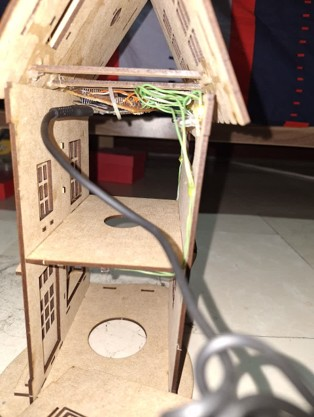
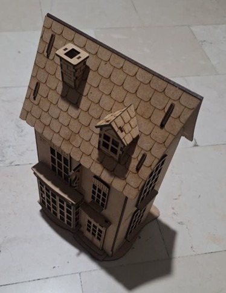

# ESP32 Smart Home LED Control

## Embedded Systems Project

A Wi-Fi based smart home prototype developed using an **ESP32 microcontroller** for wireless control and monitoring of household lighting.

The system simulates a smart home lighting environment where four independent LEDs represent different rooms. The ESP32 operates as a wireless access point and hosts an embedded web server that allows users to control the LEDs through a web interface.

The project includes:

- Embedded firmware development
- ESP32 Wi-Fi communication
- Web-based control interface
- Hardware prototype implementation
- Circuit assembly and testing

---

# Project Overview

Smart home systems provide remote monitoring and control of electrical devices using embedded controllers and wireless communication.

In this project, an ESP32 microcontroller is used as the central processing unit. The ESP32 creates its own Wi-Fi network and provides a local web interface for controlling four LED-based lighting units.

The user can connect to the ESP32 network using a smartphone or computer and control each lighting channel independently.

---

# Features

- ESP32-based embedded system
- Wi-Fi Access Point mode
- Embedded HTTP web server
- Four-channel LED lighting control
- Individual ON/OFF switching
- Real-time LED status monitoring
- Automatic status update
- Physical smart home prototype model
- Arduino-based firmware implementation

---

# System Architecture

The system consists of three main sections:

```
        Smartphone / PC
              |
              |
          Wi-Fi Network
              |
              |
            ESP32
              |
      -----------------
      |       |       |
     LED1    LED2    LED3    LED4
```

The ESP32 performs:

- Wireless communication
- Web server hosting
- User command processing
- GPIO control

---

# Hardware Components

| Component | Quantity | Description |
|---|---:|---|
| ESP32 Development Board | 1 | Main controller and Wi-Fi module |
| LEDs | 4 | Smart home lighting simulation |
| 220Ω Resistors | 4 | LED current limiting |
| Battery / Power Bank | 1 | Portable power source |
| Perfboard | 1 | Hardware implementation platform |
| Smart Home Model | 1 | Physical prototype structure |
| Power Switch | 1 | System power control |

---

# Hardware Implementation

The circuit was assembled on a physical prototype representing a smart home environment.

Each LED represents an individual lighting zone and is controlled independently by an ESP32 GPIO output.

## Prototype Images





---

# Firmware Development

The firmware was developed using:

- Arduino IDE
- C/C++ programming language

Required libraries:

```cpp
#include <WiFi.h>
#include <WebServer.h>
```

The ESP32 works in **Access Point (AP) mode**, allowing direct connection without requiring an external router.

---

# LED Control System

Four GPIO pins are assigned to the LEDs:

```cpp
const int LED_PINS[4] = {
25,
26,
27,
14
};
```

Each GPIO controls one lighting channel.

| GPIO Pin | LED |
|---|---|
| GPIO 25 | LED 1 |
| GPIO 26 | LED 2 |
| GPIO 27 | LED 3 |
| GPIO 14 | LED 4 |

---

# Web Interface

The embedded web application is stored directly inside the ESP32 firmware.

The interface provides:

- LED status display
- Individual LED control buttons
- Real-time state monitoring
- Simple mobile-friendly design

Example workflow:

1. Connect to ESP32 Wi-Fi network
2. Open browser
3. Enter ESP32 IP address
4. Control LEDs remotely

---

# Web Server Endpoints

| Endpoint | Function |
|---|---|
| `/` | Loads the main control page |
| `/toggle` | Changes LED state |
| `/status` | Returns LED states in JSON format |

---

# Project Structure

```
ESP32-Smart-Home-LED-Control/

│
├── README.md
│
├── firmware/
│   ├── led-control.ino
│   └── README.md
│
├── documentation/
│   ├── project-report-fa.pdf
│   └── README.md
│
└── images/
    ├── internal-wiring.jpg
    ├── smart-home-model.jpg
    └── README.md
```

---

# How to Run

## Hardware Setup

1. Connect LEDs to ESP32 GPIO pins.
2. Connect current limiting resistors.
3. Power the ESP32 board.
4. Upload firmware using Arduino IDE.

---

## Software Setup

1. Open:

```
firmware/led-control.ino
```

2. Select ESP32 board.
3. Upload the program.
4. Connect to ESP32 Wi-Fi network.
5. Open the web interface.

---

# Testing Results

The system was successfully tested for:

| Function | Status |
|---|---|
| ESP32 Wi-Fi Access Point | Successful |
| Web Server Operation | Successful |
| LED ON/OFF Control | Successful |
| Multiple LED Management | Successful |
| Hardware Prototype Operation | Successful |

---

# Applications

This project demonstrates concepts used in:

- Smart home automation
- IoT systems
- Wireless embedded control
- ESP32-based monitoring systems
- Home lighting automation

---

# Conclusion

This project demonstrates the design and implementation of a simple IoT-based smart home lighting controller using ESP32.

By combining embedded programming, Wi-Fi communication, and hardware prototyping, a functional wireless lighting control system was developed.

The project provides practical experience in embedded systems, IoT architecture, and microcontroller-based automation.

---

# Author

- Arghavan Memari
- Erfan Faghihi
- Alireza Montajab

Embedded Systems Course Project
